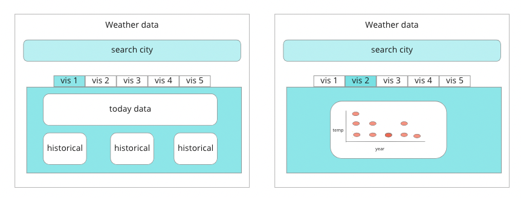

## Project
The purpose of this project is to visualize data using both Grommet CSS and D3.js technologies. I'm interested in learning how the different technologies compare and what their strengths and limitations might be.

Since the project timeline is short I've decided use Open-Meteo API since it returns data quickly, is always available, provides a lot of data (including historical data), doesn't require a lot data of wrangling, and doesn't require an API key.

The application allows a user to search for their city and displays dashboards with visualized weather inforamtion. 

## Audience
People interested in data visualization technologies (and weather data).

## Technology
<a href="https://reactjs.org/">React</a> 
<a href="https://v2.grommet.io/">Grommet CSS</a> 
<a href="https://d3js.org/">D3.js</a> 
<a href="https://open-meteo.com/">Weather data by Open-Meteo.com</a>

## Wireframe

## MVP
- Allow user to search and retrieve data from API
- One page (tab) with weather data visualization using Grommet CSS
- One page (tab) with weather data visualization using D3.js

## Stretch goals
- Adding more pages (tabs) with different visualizations
- Creating more complicated visualizations
- Deploy project

## Project Timeline
- Feb 10 - 11, 2023 : Set up and install. Work on retrieving API data, understanding the dataset, and working on autocomplete search functionality.
- Feb 12 - 13, 2023 : Work on page design and Grommet CSS. 
- Feb 14 - 15, 2023 : Work on page design and D3.js. 
- Feb 16, 2023 : Wrap up, deploy, and complete Readme.

Note: Grommet CSS and/or D3.js might take less time, which means the MVP might be completed sooner. If this happens the time will be spent working on stretch goals.