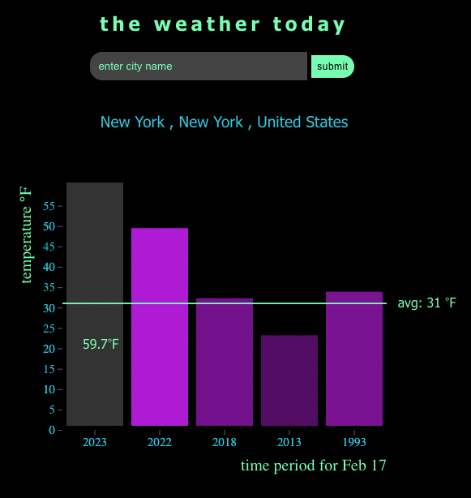

## About
**The Weather On This Day** application allows you to search for any city in world and returns the current temperature, as well as the temperature on the same day 1 year ago, 5 years ago, 10 years ago, 30 years ago. It also shows the average temperature for todays day over the past 30 years.

## Link to Site
<a href="https://weather-today-30.netlify.app/">The Weather On This Day</a>

## Application Screen Shot


## Installation Instructions
Fork and clone this repository <br>
run ```npm i```

## Technology
<a href="https://reactjs.org/">React</a><br/>
Graph using <a href="https://d3js.org/">D3.js</a><br/>
Weather data from <a href="https://open-meteo.com/">Open-Meteo.com</a>

# The Project
## Project
The goal of this project is to visualize weather data over time using D3.js.

Since the project timeline is short I've decided use Open-Meteo API since it returns data quickly, is always available, provides a lot of data (including historical data), and doesn't require an API key.

The application allows a user to search for their city and displays a graph with visualized weather information. 

## User Stories
I would like to be able to search for any city in the world and retrieve today's temperature.
I would like to see today's weather compared to the weather at different points in the past.
I would like to see how the temperature compares the average for this day over the past 30 years.

## Wireframe


## MVP
- Allow user to search and retrieve data from API
- One page with weather data visualization using D3.js

## Stretch goals
- Adding more visualizations
- Creating more complicated visualizations
- Deploy project

## Project Timeline
- Feb 10 - 11, 2023 : Set up and install. Work on retrieving API data, understanding the dataset, and working on search functionality. Work on retrieving data from API on the front end.
- Feb 12 - 13, 2023 : Create D3.js graph and get graph to read the API data.
- Feb 14 - 15, 2023 : Work styling the page, user experience, and graph interactivity.
- Feb 16, 2023 : Complete styling and interactivity, deploy, and complete Readme.

## Major Hurdles
- Originally this project was to include Grommet CSS, React, and D3.js but this proved to not be viable. Therefore the project uses HTML and CSS for styling.
- D3.js has a learning curve. Watching youTube videos was helpful, as was getting to understand some of the basics using <a href="https://observablehq.com/@d3">Observable</a>

